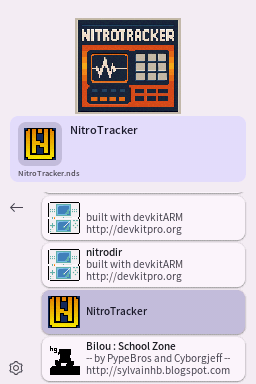
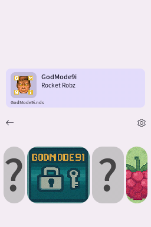

# Pico Launcher
Este repositorio contiene Pico Launcher, que es una interfaz para [Pico Loader](https://github.com/LNH-team/pico-loader).





## Características
- **Carga de juegos**: Carga homebrew y juegos comerciales usando [Pico Loader](https://github.com/LNH-team/pico-loader).
- **Multi-idioma**: Soporte integrado para inglés y español.
- **Selector de idioma**: Cambia fácilmente entre los idiomas disponibles en los ajustes.
- **Selector de temas**: Cambia la apariencia con un menú dedicado a temas.
- **Modos de visualización**:
    - Cuadrícula de iconos horizontal
    - Cuadrícula de iconos vertical
    - Lista de banners
    - Coverflow
    - Coverflow invertido
- **Clasificación de juegos**: Clasifica tu biblioteca por nombre, fecha o título.
- **Asociaciones de archivos**: Soporte para varios tipos de archivos (ver [Asociaciones de archivos](docs/FileAssociations.md)).
- **Portadas**: Soporte para portadas de juegos personalizadas (ver [Portadas (Covers)](docs/Covers.md)).
- **Temas**: Soporte para [Material Design 3 y temas personalizados](docs/Themes.md).
- **Música de fondo**: Soporte para audio en los temas (ver [Temas](docs/Themes.md)).
- **Trucos**: Soporte completo para trucos (cheats) (ver [Trucos](docs/Cheats.md)).

La documentación general de uso se puede encontrar aquí: [Uso](docs/Usage.md).

## Configuración e Instalación
Recomendamos usar WSL (Windows Subsystem for Linux) o MSYS2 para compilar este repositorio.
Los pasos proporcionados asumen que ya tienes uno de esos entornos configurados.

1. Instala [BlocksDS](https://blocksds.skylyrac.net/docs/setup/)

## Compilación

1. Ejecuta `make`

El cargador (launcher) se encontrará en el directorio raíz bajo el nombre `LAUNCHER.nds`.

2. Copia `LAUNCHER.nds` a tu tarjeta SD.
    - Si estás usando DSpico, cámbiale el nombre a `_picoboot.nds` y colócalo en la raíz de tu tarjeta SD.
3. Copia la carpeta `_pico` a la raíz de tu tarjeta SD.

> [!NOTE]
> Para usar Pico Launcher, los archivos de Pico Loader (`aplist.bin`, `savelist.bin`, `picoLoader7.bin` y `picoLoader9.bin`) también deben estar presentes en la carpeta `/_pico` de tu tarjeta SD.

Para DSpico, la estructura de directorios final se verá así:
```
.
├── _pico
│   ├── lang
│   │   ├── english.json
│   │   └── spanish.json
│   ├── themes
│   │   ├── material
│   │   │   └── theme.json
│   │   └── raspberry
│   │       ├── bannerListCell.bin
│   │       ├── bannerListCellPltt.bin
│   │       ├── bannerListCellSelected.bin
│   │       ├── bannerListCellSelectedPltt.bin
│   │       ├── bottombg.bin
│   │       ├── gridcell.bin
│   │       ├── gridcellPltt.bin
│   │       ├── gridcellSelected.bin
│   │       ├── gridcellSelectedPltt.bin
│   │       ├── scrim.bin
│   │       ├── scrimPltt.bin
│   │       ├── theme.json
│   │       └── topbg.bin
│   ├── aplist.bin
│   ├── savelist.bin
│   ├── picoLoader7.bin
│   └── picoLoader9.bin
└── _picoboot.nds
```
Nota: Si quieres jugar DSiWare en el DSpico, se requieren archivos adicionales. Consulta el readme de [Pico Loader](https://github.com/LNH-team/pico-loader) para más información.

## Licencia

Iconos por [icons8](https://icons8.com/)

Este proyecto está licenciado bajo la licencia Zlib. Para más detalles, consulta `LICENSE.txt`.

Pueden aplicar licencias adicionales al proyecto. Para más detalles, consulta el directorio `license`.

## Colaboradores
- [@Gericom](https://github.com/Gericom)
- [@XLuma](https://github.com/XLuma)
- [@Dartz150](https://github.com/Dartz150)
- [@lifehackerhansol](https://github.com/lifehackerhansol)
